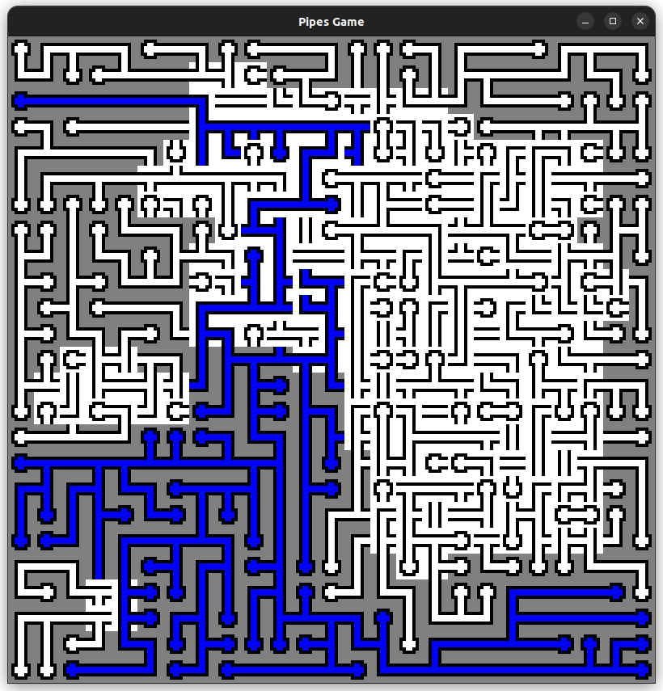

# Pipes - a puzzle game



## Table of Contents
- [Installation](#installation)
- [How to run](#how-to-run)
- [Basic Showcase](#basic-showcase)
- [Tests](#Tests)
- [What's Next?](#whats-next)

## Installation

Installation is very simple - just run

```bash
git clone https://github.com/WiktorG1542/pipes
```

and then run the `compile.sh` script. Its a simple script that contains one line:

```
g++ main.cpp -o game -lsfml-graphics -lsfml-window -lsfml-system
```

Finally, if you are getting an error similar to this:

```
main.cpp:1:10: fatal error: SFML/Graphics.hpp: No such file or directory
    1 | #include <SFML/Graphics.hpp>
      |          ^~~~~~~~~~~~~~~~~~~
compilation terminated.
```

make sure you have installed `SFML`. You can do it on Ubuntu like this:

```
sudo apt-get install libsfml-dev
```

## How to run

In order to run the game, do:

```
./game A B C D
```

> Note: when you first run the game, it will be displayed with all pieces of the same type.

, where **A**, **B**, **C**, and **D** are respectively:
 * **A** and **B** detemine the size of the puzzle.
 * **C** is the size of the puzzle - valid values of C are multiples of 8.
 * **D** is the delay that the solver will take between showing you each move.

so for example this command:
```
./game 35 35 8 0
```

will generate a medium-sized puzzle (with small-sized sprites) that will
get solved quickly, whereas this command:

```
./game 15 15 64 48
```

will generate a small puzzle (with big sprites), that will take its
time between showing you each move.

## Basic Showcase

Once you see the window, you can press keys on your keyboard or click your mouse to make the program do stuff.
Here are the options so far:

### Mouse options

 * **LEFT CLICK** - your bread and butter for manual solving. It rotates the block you clicked on.
 * **RIGHT CLICK** - it marks the square as `locked`, which results in a gray appearance.
 You should mark a square as `locked` when you are sure of its position, as it helps you
 keep track of what squares you have solved already, and which ones you should tackle next.

### Basic keyboard options

 * **Q** - quits the window and exits the program.
 * **P** - generates a new maze, using a modified version of [Prim's algorithm](https://en.wikipedia.org/wiki/Maze_generation_algorithm#Iterative_randomized_Prim's_algorithm_(without_stack,_without_sets)).
 * **D** - generates a new maze, using a *dfs-esque* approach.
 * **S** - solves the current puzzle, and shows you each step. Displays some info about each solve,
 mainly how long it took and what recursion depth the program reached, and how many times.
 * **F** - *fast solve* option, solves the puzzle, but doesnt show you every step. This is
 way faster, since the window doesnt render every step.
 * **U** - unlock and scramble, this is useful when you want to solve the same puzzle again.

### More advanced keyboard options

 * **O** - stops the solver, so that you can get a good look at the board. Press
 **O** again to start the solver again, where it left off.
 * **X** - solves all *obvious* squares - the squares that don't require any backtracking.
 You can see this very well when generating a *dfs* maze and pressing **x**, and compare
 that to generating a *prim's* maze then pressing **x** - the *dfs* maze will be almost fully
 solved, whereas the *prims* maze will still have a long way to go (only works well on larger
 (`25x25` and above puzzles)).
 * **W** - writes the current puzzle to the `puzzle.txt` file. This lets you save puzzles.
 * **R** - reads the current puzzle from the `puzzle.txt` file. This lets you try puzzles
 you have saved. Only works if the current size of the game, and the size of the saved
 puzzle match.
 * **T** - conduct tests. You will be prompted in the terminal for the number of tests you
 want to run. Then the game will *fast-solve* the number of tests you inputted, and save the
 puzzle that took the longest out of all of them to solve to the `puzzle.txt` file. It will
 also display times, and some time statistics to the terminal. 
 * **I** - toggle `DisplayInfo`. When it is on, you will see additional info, mainly:
    - the current `recursionDepth` in the top left of the window
    - statistics about how many times we were at each recursion depth in the terminal
    - and how many times we successfully "broke early", aka pruned the backtracking search tree.
 * **V** - you will get prompted for the amount of tests you want to save, and for the time.
 So if you enter for example `100ms` as the time, and `20` as the number of tests, then the
 solver will keep generating new puzzles, until it finds 20 that take longer than 100ms. All
 the puzzles will get saved to `tests/random`. That way, you can make your own test suite.
 For example, if you run `./game 25 25 24 0` and then press **V** and enter `1000` as the time,
 and `100` as the number of tests, you will end up with a hard test suite. If you were to enter
 `0` as the time instead, you would get 100 random puzzles saved to `tests/random`.

> Note: If you run tests with a number of tests smaller than 10, you will get a segFault.

> Another note: If you run tests with `DisplayInfo` on, you will be prompted whether
you want to save all of the times to `times.txt`. I have added this to be able to
store, and later visualize the times better (for example by passing that file to
another program, that makes it into a histogram).

## Tests

In the `tests/` directory you will find various puzzles, stored in the same
format as `puzzle.txt`. You can run tests like this:

```
wiktor in ~/Desktop/pipes on main ● ● λ ./run_tests.sh tests/25x25suite
successfully ran tests/25x25suite/1 in 363 seconds.
successfully ran tests/25x25suite/2 in 306 seconds.
successfully ran tests/25x25suite/3 in 270 seconds.
successfully ran tests/25x25suite/4 in 238 seconds.
successfully ran tests/25x25suite/5 in 2673 seconds.
successfully ran tests/25x25suite/6 in 474 seconds.
successfully ran tests/25x25suite/7 in 548 seconds.
successfully ran tests/25x25suite/8 in 228 seconds.
successfully ran tests/25x25suite/9 in 1168 seconds.
Ran 9 number of tests.
Average time per test: 696
wiktor in ~/Desktop/pipes on main ● ● λ 
```

Having these tests is very imporant - if we make a change to the algorithm,
we have to somehow verify that it really does gain performance, and not only
on difficult ones, but also on easy ones.

## What's Next?

This is what I want to add next:

 * **FIX CYCLE FINDER** - as for pruning, among other things we prune for is the
 closed cycle. I though it was written fine, but if you run some tests (especially
 the 50x50 ones) you will quickly find that some puzzles take 20+ minutes to solve,
 because the function responsible for finding closed cycles in the locked blocks
 doesn't find them. This is currently priority #1.
 * **CODE ORGANIZATION** - organize the code into multiple files, and use `CMake`
 to build it. This would improve the visibility/organization, and would make making
 changes a much less painstaking process.
 * **IMPROVE HEURISTICS** - once the tests are properly set up, then I will begin
 testing what heuristic to implement. You can see this currently around line 2740
 in the `main.cpp` file - I have already been playing around with some strategies.
 * **ADD MULTITHREADING** - In order to improve the times, it would be nice to add
 multithreading somehow, although I don't yet know how to tackle that.